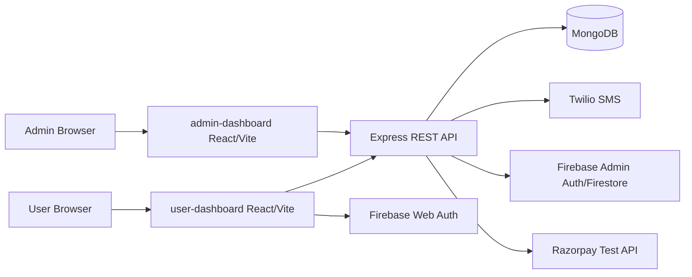
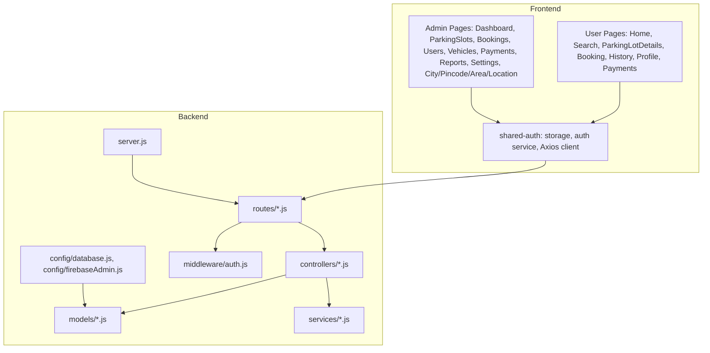
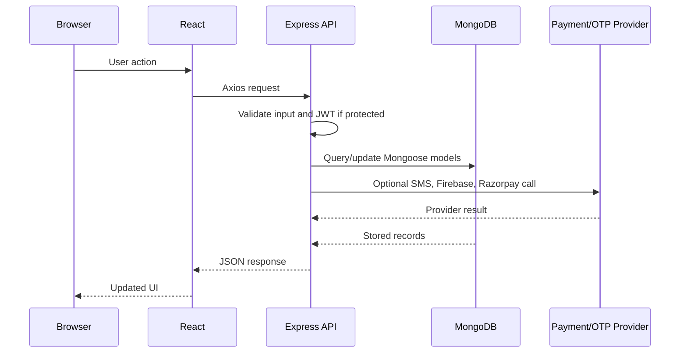
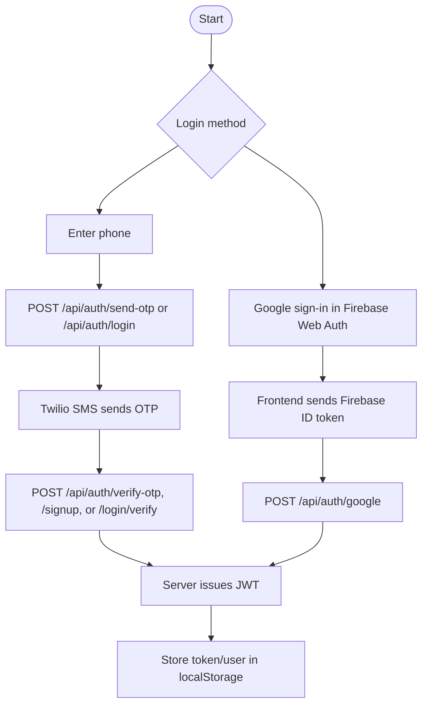
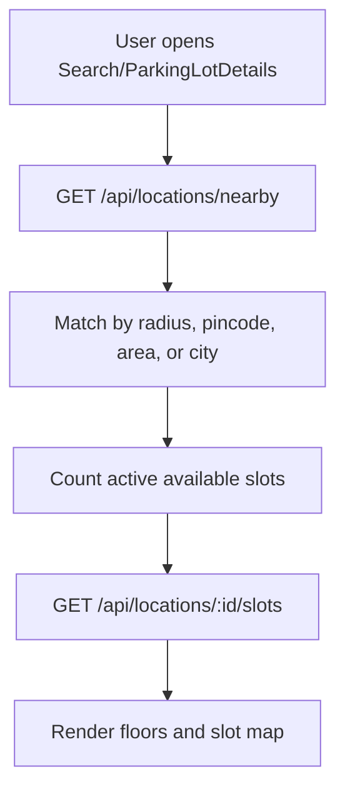
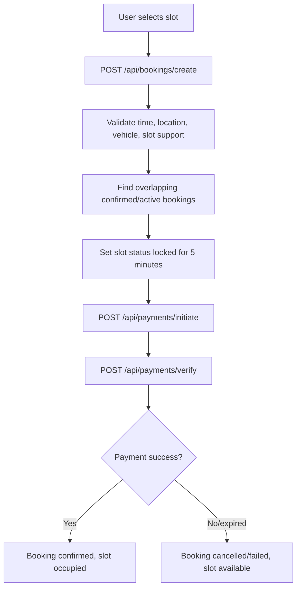
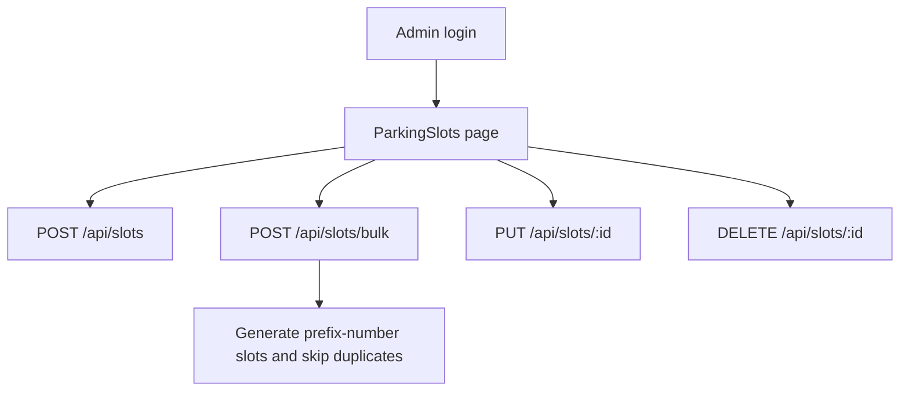
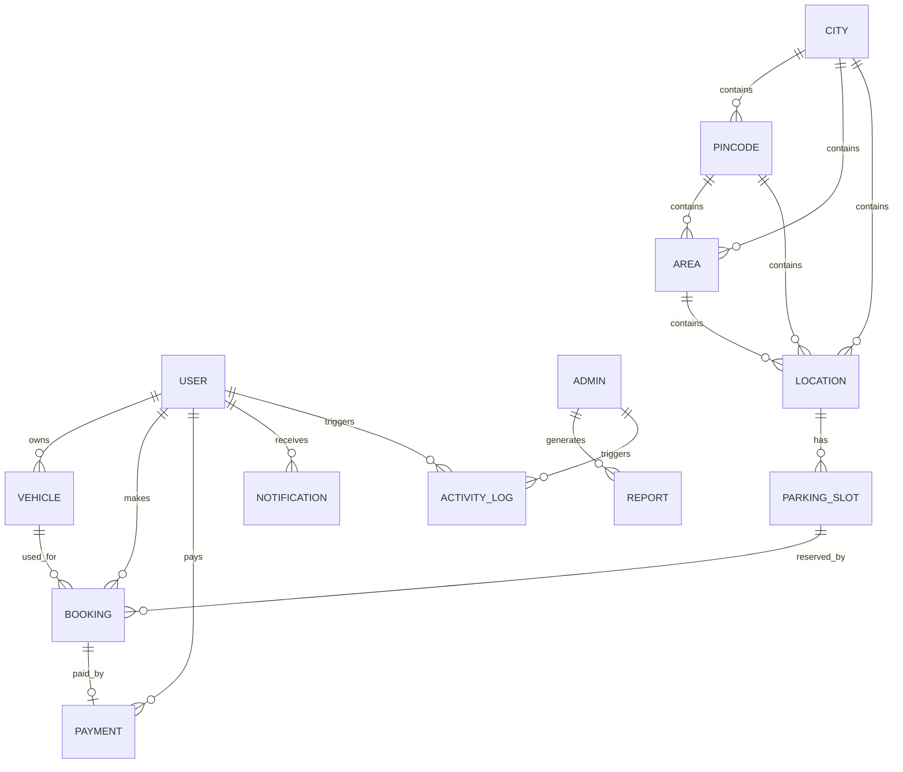
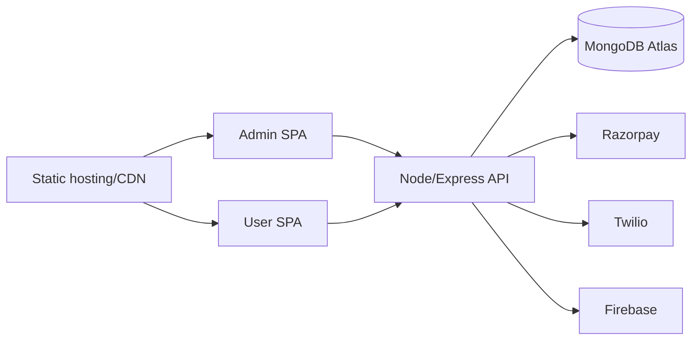

# Smart Parking System - Software Design & Technical Documentation

## 1. Executive Summary

| Item | Description |
| --- | --- |
| Project title | Smart Parking System / Park n Go |
| Primary codebase | `server`, `admin-dashboard`, `user-dashboard`, `shared-auth`, and legacy/combined `client` |
| Backend entrypoint | `server/server.js` |
| Main frontend entrypoints | `admin-dashboard/src/App.jsx`, `user-dashboard/src/App.jsx` |
| Database | MongoDB through Mongoose models in `server/models` |

### Problem Statement

The project implements a parking discovery, slot reservation, payment, and administration system. It addresses the operational problem of locating available parking, locking a slot during checkout, collecting or simulating payment, confirming reservations, and giving administrators tools to manage cities, pincodes, areas, locations, slots, users, bookings, payments, and reports.

### Objectives

- Let users authenticate with OTP or Google, discover nearby parking locations, view slot maps, reserve slots, pay, and view booking/payment history.
- Let administrators authenticate separately and manage the parking master data and operational records.
- Maintain parking-slot state through `available`, `locked`, `occupied`, and `maintenance` statuses.
- Prevent booking conflicts by checking overlapping active/confirmed bookings.
- Preserve payment and receipt data for booking handover.

### Key Features

- Public location discovery and slot blueprint APIs.
- User OTP signup/login, OTP verification, and Google authentication.
- Admin JWT login with optional development admin fallback.
- Smart booking flow with a 5-minute slot lock.
- Razorpay test-mode integration plus simulation/demo payment paths.
- Admin CRUD modules for city, pincode, area, location, parking slot, booking, user, vehicle, payment, report, and import management.
- Mongoose indexes, TTL cleanup for notifications/reports/activity logs, and activity logging.

### System Scope

The implemented system covers web frontend dashboards, REST APIs, MongoDB persistence, JWT-based session handling, Firebase Google-auth verification, Twilio SMS OTP delivery, and Razorpay payment initiation/verification. No WebSocket server or push-notification transport is implemented in the inspected code.

## 2. Project Overview

### What the System Does

The user dashboard lets parking users search locations, inspect a parking-lot slot map, create a pending booking, initiate payment, verify payment, and view bookings/receipts. The admin dashboard manages the operational data that powers the user experience.

### Users

| User type | Implementation evidence | Capabilities |
| --- | --- | --- |
| Public visitor | `user-dashboard/src/App.jsx`, public `GET /api/locations/*` and `GET /api/slots/*` routes | View homepage, search, public locations, and slot availability data |
| Authenticated user | `server/middleware/auth.js`, `server/routes/bookings.js`, `server/routes/payments.js`, `server/routes/vehicles.js` | Book slots, manage vehicles, pay, view history/profile |
| Admin/superadmin | `server/models/Admin.js`, protected admin routes | Manage master data, users, bookings, slots, payments, reports |

### Real-World Use Case

A driver opens the user dashboard, searches for nearby parking, selects a location and vehicle type, chooses an available slot from the location blueprint, creates a smart booking, pays within the lock window, and receives a confirmed booking and receipt. Administrators maintain locations and slots, monitor bookings/payments, and generate reports.

### Benefits

- Reduces uncertainty by exposing parking location and slot information.
- Prevents double booking through time-conflict checks.
- Gives users a payment-backed confirmation flow.
- Gives admins structured control over geographic hierarchy and parking inventory.

## 3. System Architecture

### High-Level Architecture



### Component Architecture



### Architecture Explanation

`server/server.js` initializes Express, CORS, JSON/body parsing, `/health`, root API routing, and database connection. `server/routes/index.js` mounts domain routes under `/api`. Each domain route delegates to a controller and, where needed, uses `protect` and `authorize` from `server/middleware/auth.js`. Persistence is handled by Mongoose models in `server/models`.

The frontends are separate Vite React applications. Both use `shared-auth/apiClient.js` to attach `Authorization: Bearer <token>` and clear session state on HTTP 401. `admin-dashboard` stores credentials under the `admin-dashboard:*` localStorage keys, while `user-dashboard` uses `user-dashboard:*`.

### Data Flow Explanation



### Request-Response Lifecycle

1. React page calls a function from `src/services/api.js`.
2. `shared-auth/apiClient.js` injects the stored JWT if present.
3. Express receives the request through `server/server.js`.
4. `server/routes/index.js` dispatches to a domain route.
5. Route validators from `express-validator` run where configured.
6. `protect` verifies JWT and attaches `req.user` for protected routes.
7. Controller performs business logic and Mongoose operations.
8. Controller returns `{ success, message?, data? }` JSON.
9. Axios response interceptor clears local session and redirects on 401.

## 4. Technology Stack

| Layer | Technology | Version from code | Purpose | Why used |
| --- | --- | --- | --- | --- |
| Backend runtime | Node.js | package runtime, no exact Node version pinned | Executes Express server | Common JavaScript backend runtime |
| Backend framework | Express | `^4.18.2` | REST routing/middleware | Lightweight API server |
| Database ODM | Mongoose | `^7.5.0` | MongoDB schemas, validation, indexes | Structured document modeling |
| Database | MongoDB | via `MONGODB_URI` | Persistent data store | Fits document-based entities and nested snapshots |
| Auth tokens | jsonwebtoken | `^9.0.2` | JWT signing/verifying | Stateless API authentication |
| Password hashing | bcryptjs | `^2.4.3` | Hash/compare passwords | Protects user/admin passwords |
| Validation | express-validator | `^7.0.1` | Request validation | Route-level validation |
| CORS/config | cors, dotenv | `^2.8.5`, `^16.3.1` | CORS and env loading | Frontend-backend separation and configuration |
| SMS OTP | twilio | `^5.5.3` | SMS OTP sending | Phone verification/login |
| Google/Firebase auth | firebase-admin, firebase | `^13.10.0`, `^12.1.0` | Verify Firebase ID tokens and frontend Google auth | Google login integration |
| Payments | Razorpay | `^2.9.6` | Test-mode orders/signature verification | Payment gateway integration |
| Frontend | React / React DOM | `^18.2.0` | UI applications | Component-driven SPA |
| Build tool | Vite | `^7.3.1` | Dev/build pipeline | Fast frontend builds |
| Routing | react-router-dom | `^6.15.0` | SPA routing | Page navigation |
| HTTP | axios | `^1.5.0` | API requests | Interceptors for auth |
| Styling | Tailwind CSS, PostCSS, Autoprefixer | `^3.3.3`, `^8.4.27`, `^10.4.14` | Utility-first styling | Consistent UI styling |
| Forms | react-hook-form, yup, @hookform/resolvers | `^7.45.4`, `^1.2.0`, `^3.3.2` | Form state/validation | Declarative form handling |
| UI helpers | lucide-react, react-icons, react-toastify, sweetalert2 | package manifests | Icons, notifications, dialogs | Dashboard UX |
| Charts | recharts | `^2.7.2` | Admin dashboard/report charts | Visual analytics |
| Maps | leaflet, react-leaflet, @googlemaps/react-wrapper | user dashboard | Parking map/location display | Geographic discovery UI |
| CSV import | papaparse | `^5.5.3` | Parse imported data | Admin bulk import support |

## 5. Folder Structure Analysis

| Path | Purpose |
| --- | --- |
| `server` | Express backend API, controllers, models, middleware, services, config, seed/test scripts |
| `server/controllers` | Request handlers and business logic by domain |
| `server/routes` | REST endpoint definitions and validation middleware |
| `server/models` | Mongoose schemas for users, admins, locations, slots, bookings, payments, reports, logs, etc. |
| `server/middleware` | Authentication/authorization, rate limit helper, error handling |
| `server/config` | MongoDB and Firebase Admin configuration |
| `server/services` | Firebase user sync, email templates, OTP rate limiting, Twilio Verify service helpers |
| `server/utils` | Validation, response helpers, phone/dev-admin/id utilities |
| `admin-dashboard` | Admin-only Vite React SPA |
| `admin-dashboard/src/admin/pages` | Admin page modules for dashboard and CRUD operations |
| `admin-dashboard/src/components` | Reusable admin UI components |
| `admin-dashboard/src/context` | Admin auth context and session restoration |
| `admin-dashboard/src/services` | Admin API wrapper |
| `user-dashboard` | User-facing Vite React SPA |
| `user-dashboard/src/user/pages` | User pages for home/search/booking/history/profile/payments/auth |
| `user-dashboard/src/user/components` | User-specific parking map and payment UI |
| `user-dashboard/src/components` | Shared user dashboard UI components |
| `user-dashboard/src/context` | User auth context, pending booking localStorage helpers |
| `user-dashboard/src/config` | Firebase Web Auth config |
| `shared-auth` | Shared Axios client, auth storage, auth service used by dashboards |
| `client` | Additional combined/legacy Vite React app containing admin and user code copies |
| `docs` | Existing guides and generated project documentation |

## 6. Functional Modules

| Module | Purpose | Inputs | Outputs | Dependencies |
| --- | --- | --- | --- | --- |
| Authentication | OTP, Google, admin login, profile lookup | phone, OTP, Firebase `idToken`, email/password, JWT | JWT, user/admin profile | `User`, `Admin`, Twilio, Firebase Admin, `jsonwebtoken` |
| Geographic master data | Manage city, pincode, area, location hierarchy | names, ids, status, coordinates | CRUD records | `City`, `Pincode`, `Area`, `Location` |
| Location discovery | Return public/nearby locations and slot blueprints | lat/lng, city, area, pincode, vehicleType | matching locations, floors, slots, availability counts | `Location`, `ParkingSlot` |
| Slot management | Create/update/delete single or bulk slots | location data, slot range/prefixes, vehicle/slot type, price | slot records and counts | `ParkingSlot`, `Location` |
| Booking | Create bookings, smart lock, cancel, extend, check-in/out | slot, vehicle, time, duration, location | booking records, notifications, logs | `Booking`, `ParkingSlot`, `Vehicle`, `Notification`, `ActivityLog` |
| Payment | Initiate/verify/process payments | booking id, method, gateway response | payment, confirmed/cancelled booking, receipt | `Payment`, `Booking`, `ParkingSlot`, Razorpay |
| Vehicle | User vehicle CRUD | license plate, make, model, year, color, type | vehicle records | `Vehicle`, `User` |
| Reporting | Admin dashboard and saved reports | date range, report type | stats/report records | `Report`, booking/payment/user models |
| Import | Admin data import | import type and payload | inserted/updated records | `importController`, master models |
| Notifications/activity | Persist in-app notifications and audit logs | event metadata | notification/log documents | `Notification`, `ActivityLog` |

## 7. User Workflow

### Registration/Login



### Parking Slot Discovery



### Slot Reservation and Payment



### Slot Management



### Admin Operations

Admins authenticate through `POST /api/auth/admin/login`, then use protected routes for dashboards and CRUD modules. `admin-dashboard/src/App.jsx` wraps protected routes in `ProtectedAdminRoutes`, and `admin-dashboard/src/services/api.js` maps each page to its API module.

## 8. Database Documentation

### ER Diagram



### Table/Collection Descriptions

| Collection | Model file | Key fields | Relationships/constraints |
| --- | --- | --- | --- |
| `users` | `server/models/User.js` | name, email, password, phone, firebaseUid, role, authProviders, verification flags | Unique sparse email/phone/firebaseUid; virtual vehicles/bookings/payments |
| `admins` | `server/models/Admin.js` | name, email, password, role, permissions, isActive | Unique email; password hashed; role enum admin/superadmin |
| `cities` | `server/models/City.js` | name, state, status | Unique compound index `{ name, state }` |
| `pincodes` | `server/models/Pincode.js` | pincode, cityId, status | `cityId -> City`; six-digit pincode; unique `{ pincode, cityId }` |
| `areas` | `server/models/Area.js` | name, pincodeId, cityId, status | Links to Pincode and City; unique `{ name, pincodeId, cityId }` |
| `locations` | `server/models/Location.js` | name, lat, lng, areaId, pincodeId, cityId, floors | Links to Area/Pincode/City; unique location within hierarchy |
| `parkingslots` | `server/models/ParkingSlot.js` | slotNumber, locationId, city, area, location, pincode, vehicleType, slotType, floor, row, column, price, status, lock fields | `locationId -> Location`; status enum; lock data points to User and Booking |
| `bookings` | `server/models/Booking.js` | user, parkingSlot, vehicle, bookingReference, status, startTime, endTime, pricing, paymentLock, locationSnapshot | References User, ParkingSlot, Vehicle, Payment; conflict helper checks overlapping confirmed/active bookings |
| `payments` | `server/models/Payment.js` | user, booking, paymentReference, amount, method, gateway, status, Razorpay ids, verification, receiptSnapshot | References User/Booking/Admin; payment reference generated pre-validation |
| `vehicles` | `server/models/Vehicle.js` | owner, licensePlate, make, model, year, color, vehicleType, isDefault | `owner -> User`; unique plate; only one default per user enforced pre-save |
| `notifications` | `server/models/Notification.js` | user, type, title, message, channels, priority, status, expiresAt | `user -> User`; TTL index on `expiresAt` |
| `activitylogs` | `server/models/ActivityLog.js` | user, admin, action, resource, resourceId, description, details, severity, status, expiresAt | References User/Admin; TTL index; audit trail |
| `reports` | `server/models/Report.js` | title, type, parameters, data, summary, generatedBy, schedule, expiresAt | `generatedBy -> Admin`; TTL index |
| `counters` | `server/models/Counter.js` | `_id`, seq | Generic sequence counter |

## 9. API Documentation

Base backend URL is configured by `VITE_API_BASE_URL` in the frontends. API routes are mounted under `/api` in `server/server.js`, except Razorpay routes are also mounted at the root.

### Endpoint Inventory

| Method | Route | Purpose | Auth |
| --- | --- | --- | --- |
| GET | `/health` | Health and database connection status | Public |
| GET | `/api/` | Root API response | Public |
| POST | `/api/auth/send-otp` | Send SMS OTP | Public |
| POST | `/api/auth/verify-otp` | Verify standalone OTP | Public |
| POST | `/api/auth/signup` | Signup after OTP | Public |
| POST | `/api/auth/login` | Start phone OTP login | Public |
| POST | `/api/auth/login/verify` | Verify login OTP and issue JWT | Public |
| POST | `/api/auth/google` | Verify Firebase ID token and issue JWT | Public |
| GET | `/api/auth/profile` | Current user/admin profile | Bearer JWT |
| GET | `/api/auth/logout` | Logout response | Public in route, intended session endpoint |
| POST | `/api/auth/admin/login` | Admin login | Public |
| GET | `/api/locations/nearby` | Find nearby/matching public locations | Public |
| GET | `/api/locations/:id/slots` | Get location slot blueprint | Public |
| GET | `/api/locations/public` | List public active locations | Public |
| GET | `/api/locations/public/:id` | Get public active location | Public |
| GET/POST | `/api/locations` | Admin list/create locations | Admin/superadmin |
| GET/PUT/DELETE | `/api/locations/:id` | Admin read/update/delete location | Admin/superadmin |
| GET/POST | `/api/cities` | Admin list/create cities | Admin/superadmin |
| GET/PUT/DELETE | `/api/cities/:id` | Admin read/update/delete city | Admin/superadmin |
| GET/POST | `/api/pincodes` | Admin list/create pincodes | Admin/superadmin |
| GET/PUT/DELETE | `/api/pincodes/:id` | Admin read/update/delete pincode | Admin/superadmin |
| GET/POST | `/api/areas` | Admin list/create areas | Admin/superadmin |
| GET/PUT/DELETE | `/api/areas/:id` | Admin read/update/delete area | Admin/superadmin |
| GET | `/api/slots` | List slots | Public |
| GET | `/api/slots/available` | List slots; query validates start/end but controller returns all slots | Public |
| GET | `/api/slots/:id` | Get slot | Public |
| POST | `/api/slots/bulk`, `/api/slots/bulk/create` | Bulk slot creation | Admin/superadmin |
| POST | `/api/slots` | Create slot | Admin/superadmin |
| PUT/DELETE | `/api/slots/:id` | Update/delete slot | Admin/superadmin |
| GET | `/api/slots/:id/stats` | Slot stats placeholder | Admin/superadmin |
| POST | `/api/slots/:id/maintenance` | Maintenance placeholder | Admin/superadmin |
| GET | `/api/bookings` | List own bookings or admin-filtered bookings | Bearer JWT |
| GET | `/api/bookings/me` | Current user's bookings with receipt payload | Bearer JWT |
| POST | `/api/bookings/create` | Smart booking slot lock flow | Bearer JWT |
| POST | `/api/bookings` | Legacy booking creation | Bearer JWT |
| GET/PUT | `/api/bookings/:id` | Read/update booking | Owner or admin |
| PUT | `/api/bookings/:id/cancel` | Cancel booking | Owner or admin |
| PUT | `/api/bookings/:id/extend` | Extend active booking | Owner or admin |
| POST | `/api/bookings/:id/checkin` | Check in with code | Owner |
| POST | `/api/bookings/:id/checkout` | Check out with code | Owner |
| GET | `/api/payments` | List own/admin payments | Bearer JWT |
| POST | `/api/payments/initiate` | Initiate smart-booking payment | Bearer JWT |
| POST | `/api/payments/verify` | Verify smart-booking payment | Bearer JWT |
| POST | `/api/payments` | Legacy direct payment processing | Bearer JWT |
| GET | `/api/payments/:id` | Get payment | Owner or admin |
| POST | `/api/create-order`, `/create-order` | Razorpay order creation route | Public in route file |
| POST | `/api/verify-payment`, `/verify-payment` | Razorpay payment verification route | Public in route file |
| GET | `/api/user-payments/:userId`, `/user-payments/:userId` | User Razorpay payments | Public in route file |
| GET | `/api/admin/payments`, `/admin/payments` | Admin Razorpay payments | Admin |
| GET/POST | `/api/vehicles` | User vehicle list/create | Bearer JWT |
| GET/PUT/DELETE | `/api/vehicles/:id` | User vehicle read/update/delete | Bearer JWT |
| GET | `/api/users` | Admin user list | Admin/superadmin |
| GET/PUT | `/api/users/:id` | Read/update user | Authenticated; controller enforces access |
| DELETE | `/api/users/:id` | Delete user | Admin/superadmin |
| GET | `/api/users/:id/stats` | User stats | Authenticated |
| GET | `/api/users/:id/activity` | User activity | Admin/superadmin |
| GET | `/api/reports/dashboard` | Dashboard statistics | Admin/superadmin |
| GET/POST | `/api/reports` | List/create reports | Admin/superadmin |
| GET/DELETE | `/api/reports/:id` | Read/delete report | Admin/superadmin |
| POST | `/api/imports/:type` | Import data by type | Admin/superadmin |

### Representative Request/Response Shapes

All JSON responses generally follow:

```json
{
  "success": true,
  "message": "Optional message",
  "data": {}
}
```

Authentication failures return HTTP 401 with:

```json
{
  "success": false,
  "message": "Not authorized to access this route"
}
```

Validation failures return HTTP 400 with either `errors: [...]` from `express-validator` or a domain-specific `message`.

### OpenAPI Starter Specification

```yaml
openapi: 3.0.3
info:
  title: Smart Parking System API
  version: 1.0.0
servers:
  - url: http://127.0.0.1:5000/api
components:
  securitySchemes:
    bearerAuth:
      type: http
      scheme: bearer
      bearerFormat: JWT
paths:
  /auth/admin/login:
    post:
      summary: Admin login
      requestBody:
        required: true
        content:
          application/json:
            schema:
              type: object
              required: [email, password]
              properties:
                email: { type: string, format: email }
                password: { type: string }
      responses:
        "200": { description: JWT and admin profile }
        "401": { description: Invalid credentials }
  /auth/send-otp:
    post:
      summary: Send OTP to Indian phone number
      requestBody:
        required: true
        content:
          application/json:
            schema:
              type: object
              required: [phone]
              properties:
                phone: { type: string }
      responses:
        "200": { description: OTP send status }
  /locations/nearby:
    get:
      summary: Get nearby parking locations
      parameters:
        - in: query
          name: lat
          required: true
          schema: { type: number }
        - in: query
          name: lng
          required: true
          schema: { type: number }
        - in: query
          name: radiusKm
          schema: { type: number, minimum: 1, maximum: 25 }
        - in: query
          name: vehicleType
          schema: { type: string, enum: [car, bike] }
      responses:
        "200": { description: Matching locations }
  /bookings/create:
    post:
      summary: Create smart booking and lock selected slot
      security: [{ bearerAuth: [] }]
      responses:
        "201": { description: Booking created and slot locked }
        "409": { description: Slot conflict or locked by another user }
  /payments/initiate:
    post:
      summary: Initiate payment for a locked booking
      security: [{ bearerAuth: [] }]
      responses:
        "200": { description: Payment session }
        "409": { description: Booking lock expired }
  /payments/verify:
    post:
      summary: Verify payment and confirm/cancel booking
      security: [{ bearerAuth: [] }]
      responses:
        "200": { description: Payment verification result }
        "400": { description: Razorpay signature verification failed }
```

## 10. Authentication & Security

### Authentication Flow

- User OTP flow is implemented in `server/controllers/authPlaceholderController.js`. Phone numbers are normalized to Indian format, OTP is stored in an in-memory `Map`, expires after 5 minutes, and JWT is issued after signup or login verification.
- Google login uses Firebase Web Auth in `user-dashboard/src/config/firebase.js` and Firebase Admin token verification in `server/config/firebaseAdmin.js`.
- Admin login is implemented in `server/controllers/authController.js` with bcrypt password comparison and a JWT role of `admin`.

### Authorization Logic

`server/middleware/auth.js` verifies Bearer tokens using `JWT_SECRET`, loads `Admin` or `User` by decoded role, blocks inactive users, and exposes `authorize(...roles)` for admin/superadmin route protection.

### Session/Token Handling

`shared-auth/authStorage.js` stores token and user JSON in localStorage. `shared-auth/apiClient.js` injects the token into every request and clears storage on HTTP 401.

### Security Measures Found

- Passwords are hashed with bcrypt pre-save hooks.
- JWT expiry defaults to `JWT_EXPIRE` or 7 days.
- Route validation uses `express-validator`.
- CORS origin list comes from `CLIENT_URL` or localhost defaults.
- Razorpay verification compares HMAC SHA-256 signatures.
- Razorpay controller only accepts keys starting with `rzp_test_`.
- Activity logs record significant auth, booking, and payment events.

### Risks and Mitigations

| Risk | Evidence | Mitigation |
| --- | --- | --- |
| OTP store is in-memory | `authPlaceholderController.js` uses `const otpStore = new Map()` | Use Redis or database-backed OTP store for multi-instance deployments |
| Some Razorpay routes are public | `server/routes/razorpayPayments.js` exposes create/verify/user payments without `protect` except admin payments | Require JWT and ownership checks for user payment routes |
| Logout route is `GET` and not protected in route file | `server/routes/auth.js` | Change to protected `POST /logout` |
| `GET /api/slots/available` validates time but returns all slots | `slotController.getAvailableSlots` | Apply conflict/status/time filtering or rename endpoint |
| LocalStorage JWT is vulnerable to XSS theft | `shared-auth/authStorage.js` | Use hardened CSP, avoid unsafe HTML, consider httpOnly cookies |
| Firebase web config is hardcoded | `user-dashboard/src/config/firebase.js` | Move to `VITE_FIREBASE_*` env vars |
| Email service references `nodemailer` but dependency is not in `server/package.json` | `server/services/emailService.js` | Add dependency or remove unused service |

## 11. Core Algorithms & Business Logic

### Parking Allocation / Smart Booking

Implemented in `server/controllers/bookingController.js` in `createSmartBooking`.

```text
validate locationId and parkingSlotId
resolve booking start/end from startTime or date + time
reject past or invalid start time
load location, slot, current user, and selected/default/placeholder vehicle
ensure slot belongs to location
release expired slot lock if needed
reject inactive, occupied, reserved, incompatible, or unpriced slot
check Booking.findConflictingBookings(slot, start, end)
reject if active/confirmed booking overlaps
reject if locked by another user
calculate subtotal and 18% tax
create pending booking with paymentLock
set slot status = locked and lockExpiresAt = now + 5 minutes
return booking and lock expiry
```

### Slot Availability Calculation

The most complete availability calculation is in `locationController.getNearbyLocations` and `getLocationBlueprint`. Expired locks are released, reserved slots are excluded from bookable counts, and available count is calculated from slots whose status is `available`.

### Conflict Detection

`Booking.findConflictingBookings` checks:

```text
same parkingSlot
status in confirmed or active
existing.startTime < requestedEnd
existing.endTime > requestedStart
```

This is the standard interval-overlap condition.

### Payment Verification

`paymentController.verifyPayment` validates ownership, verifies Razorpay HMAC when Razorpay fields exist, marks payment `completed`, sets booking `confirmed` and `paymentStatus = paid`, clears the slot lock, and sets slot `status = occupied`. Failed verification cancels the booking and releases the slot.

### Real-Time Update Mechanisms

No WebSockets, Socket.IO, server-sent events, or polling loop were found in the backend. Live-ish behavior is achieved by re-fetching location/slot APIs and by expiring locks when relevant controller methods load slots.

## 12. Frontend Documentation

### User Dashboard

Routes in `user-dashboard/src/App.jsx`:

| Route | Page |
| --- | --- |
| `/` | `Home` |
| `/login` | `Login` |
| `/signup` | `Signup` |
| `/search` | `Search` |
| `/parking/:parkingLotId` | `ParkingLotDetails` |
| `/booking` | `Booking` |
| `/history` | `History` |
| `/profile` | `Profile` |
| `/payments` | `Payments` |

Important components include `ParkingLotSlotMap.jsx`, `HeroParkingMap.jsx`, `PaymentButton.jsx`, `Receipt.jsx`, `ReceiptTicket.jsx`, and payment components under `user-dashboard/src/user/components/payment`.

### Admin Dashboard

Routes in `admin-dashboard/src/App.jsx`:

| Route | Page |
| --- | --- |
| `/admin/login` | Admin login |
| `/admin/dashboard` | Dashboard |
| `/admin/parking-slots` | Parking slot CRUD/bulk creation |
| `/admin/bookings` | Booking management |
| `/admin/users` | User management |
| `/admin/vehicles` | Vehicle records |
| `/admin/payments` | Payment records |
| `/admin/city` | City master |
| `/admin/pincode` | Pincode master |
| `/admin/area` | Area master |
| `/admin/location` | Location master |
| `/admin/reports` | Reports |
| `/admin/settings` | Preferences/settings |
| `/admin/profile` | Admin profile |

### State Management and Routing

Both dashboards use React Context for auth state. There is no Redux/MobX store. Session restoration happens on mount from localStorage. Routing is handled by React Router. Admin routes are protected by `ProtectedAdminRoutes` in `admin-dashboard/src/App.jsx`.

## 13. Backend Documentation

### Backend Layers

| Layer | Location | Responsibility |
| --- | --- | --- |
| Server bootstrap | `server/server.js` | Env load, CORS, parsers, health route, DB connect, route mounting |
| Routes | `server/routes/*.js` | HTTP paths, validators, auth middleware composition |
| Controllers | `server/controllers/*.js` | Business logic and model operations |
| Models | `server/models/*.js` | Data schema, validation, indexes, model methods |
| Middleware | `server/middleware/auth.js` | JWT auth, role authorization, optional auth, basic rate limiter |
| Config | `server/config/database.js`, `server/config/firebaseAdmin.js` | MongoDB and Firebase Admin setup |
| Services | `server/services/*.js` | Firebase user sync, email templates, OTP throttling, Twilio Verify helpers |

### Controller Responsibilities

- `authController.js`: admin login, legacy password login/register functions, profile, password/profile updates.
- `authPlaceholderController.js`: active OTP signup/login and Google auth used by user dashboard.
- `bookingController.js`: booking CRUD, smart booking lock, check-in/out, cancellation, extension.
- `slotController.js`: slot CRUD, bulk creation, placeholder stats/maintenance.
- `locationController.js`: location CRUD, public locations, nearby matching, blueprint.
- `paymentController.js`: list/get/process/initiate/verify payments.
- Other CRUD controllers manage city, pincode, area, user, vehicle, report, and import features.

## 14. Real-Time Features

No real-time transport is implemented. The codebase does not include WebSocket, Socket.IO, SSE, or push notification sender logic. Existing live-update behavior depends on REST reads and lock-expiry cleanup during API requests. Notification persistence exists in `server/models/Notification.js`, but delivery is a placeholder method that marks records as sent.

## 15. Deployment Architecture

### Environment Variables

| Area | Variables found |
| --- | --- |
| Server runtime | `NODE_ENV`, `PORT`, `CLIENT_URL` |
| MongoDB | `MONGODB_URI`, `MONGODB_CONNECT_ON_START`, `MONGODB_SERVER_SELECTION_TIMEOUT_MS`, `ALLOW_SERVER_WITHOUT_DB` |
| JWT | `JWT_SECRET`, `JWT_EXPIRE` |
| Dev admin | `ALLOW_DEV_ADMIN_LOGIN`, `DEV_ADMIN_EMAIL`, `DEV_ADMIN_PASSWORD` |
| Twilio | `TWILIO_ACCOUNT_SID`, `TWILIO_AUTH_TOKEN`, `TWILIO_PHONE_NUMBER`, also service code supports `TWILIO_VERIFY_SERVICE_SID` |
| Razorpay | `RAZORPAY_KEY_ID`, `RAZORPAY_KEY_SECRET` |
| Firebase Admin | Code supports `FIREBASE_SERVICE_ACCOUNT_JSON` or `FIREBASE_ADMIN_PROJECT_ID`, `FIREBASE_ADMIN_CLIENT_EMAIL`, `FIREBASE_ADMIN_PRIVATE_KEY`; repo also contains `server/config/firebaseServiceAccount.json` |
| Frontend | `VITE_API_BASE_URL`, `VITE_AUTH_REDIRECT_PATH` |

### Build and Run

| App | Install | Dev | Build | Preview/start |
| --- | --- | --- | --- | --- |
| Backend | `npm install` in `server` | `npm run dev` | N/A | `npm start` |
| Admin | `npm install` in `admin-dashboard` | `npm run dev` | `npm run build` | `npm run preview` |
| User | `npm install` in `user-dashboard` | `npm run dev` | `npm run build` | `npm run preview` |
| Client | `npm install` in `client` | `npm run dev` | `npm run build` | `npm run preview` |

### Production Architecture

Recommended production deployment:



Infrastructure requirements include a Node.js host for the API, MongoDB, environment secret management, HTTPS, and static hosting for built Vite assets.

## 16. Testing Documentation

No unit test framework, integration test suite, or coverage configuration was found in package scripts. The backend has manual scripts `server/testApi.js` and `server/testTwilio.js`, and utility scripts `seed.js` and `cleanup.js`. Frontend packages include `lint` scripts but no test scripts.

Recommended strategy:

- Add controller/service unit tests for booking conflicts, slot locks, payment verification, and auth validation.
- Add integration tests for `/api/bookings/create`, `/api/payments/initiate`, `/api/payments/verify`, and admin CRUD endpoints.
- Add frontend smoke tests for user booking and admin slot creation workflows.

## 17. Challenges & Design Decisions

| Decision | Evidence | Tradeoff |
| --- | --- | --- |
| Separate admin and user SPAs | `admin-dashboard`, `user-dashboard` | Clear role-specific UX, duplicated dependencies/builds |
| Shared auth helper | `shared-auth` | Reduces auth boilerplate, still keeps dashboard-specific storage prefixes |
| Mongoose document snapshots | `Booking.locationSnapshot`, `Payment.receiptSnapshot` | Receipts remain stable after location changes, duplicates data |
| Slot lock before payment | `LOCK_WINDOW_MS = 5 * 60 * 1000` | Reduces double booking during checkout, needs robust cleanup |
| REST-only updates | No real-time backend dependency | Simpler deployment, less immediate live availability |
| Test-mode Razorpay only | `getRazorpayConfig` requires `rzp_test_` | Safer for demo/project use, not production-ready until relaxed carefully |

## 18. Future Improvements

- Add proper real-time availability updates with Socket.IO or SSE.
- Persist OTP state and rate limits in Redis.
- Add background job to release expired locks without waiting for API reads.
- Harden all Razorpay routes with authentication and ownership checks.
- Implement true filtered availability in `GET /api/slots/available`.
- Move Firebase frontend config to Vite env variables.
- Add automated tests and CI.
- Add OpenAPI generation from route metadata or maintain a full `openapi.yaml`.
- Add admin permission checks beyond role checks for fine-grained capabilities.
- Add audit log views and notification delivery integrations.

## 19. Conclusion

The Smart Parking System is a full-stack MERN-style parking management platform with separate user and admin dashboards, a layered Express backend, MongoDB persistence, JWT authentication, OTP/Google login support, slot locking, and payment verification. The strongest implemented business flow is the smart booking sequence: discover location, inspect blueprint, lock a compatible slot, initiate payment, verify payment, and convert the slot to occupied.

## 20. Appendices

### Complete Configuration Reference

Do not commit real secrets. Use `.env.example` files as templates and keep production values in deployment secret storage.

```env
NODE_ENV=
PORT=
CLIENT_URL=
MONGODB_URI=
MONGODB_CONNECT_ON_START=
MONGODB_SERVER_SELECTION_TIMEOUT_MS=
JWT_SECRET=
JWT_EXPIRE=
ALLOW_SERVER_WITHOUT_DB=
ALLOW_DEV_ADMIN_LOGIN=
DEV_ADMIN_EMAIL=
DEV_ADMIN_PASSWORD=
TWILIO_ACCOUNT_SID=
TWILIO_AUTH_TOKEN=
TWILIO_PHONE_NUMBER=
TWILIO_VERIFY_SERVICE_SID=
RAZORPAY_KEY_ID=
RAZORPAY_KEY_SECRET=
FIREBASE_SERVICE_ACCOUNT_JSON=
FIREBASE_ADMIN_PROJECT_ID=
FIREBASE_ADMIN_CLIENT_EMAIL=
FIREBASE_ADMIN_PRIVATE_KEY=
VITE_API_BASE_URL=
VITE_AUTH_REDIRECT_PATH=
```

### Dependency Lists

See:

- `server/package.json`
- `admin-dashboard/package.json`
- `user-dashboard/package.json`
- `client/package.json`

### Important Code References

| Topic | Code location |
| --- | --- |
| Server bootstrap | `server/server.js` |
| API route registry | `server/routes/index.js` |
| Auth middleware | `server/middleware/auth.js` |
| OTP/Google user auth | `server/controllers/authPlaceholderController.js` |
| Admin auth | `server/controllers/authController.js` |
| Smart booking | `server/controllers/bookingController.js` |
| Payment initiate/verify | `server/controllers/paymentController.js` |
| Location discovery/blueprint | `server/controllers/locationController.js` |
| Slot CRUD/bulk | `server/controllers/slotController.js` |
| Database connection | `server/config/database.js` |
| Firebase Admin | `server/config/firebaseAdmin.js` |
| User frontend routing | `user-dashboard/src/App.jsx` |
| User API client | `user-dashboard/src/services/api.js` |
| User auth context | `user-dashboard/src/context/AuthContext.jsx` |
| Admin frontend routing | `admin-dashboard/src/App.jsx` |
| Admin API client | `admin-dashboard/src/services/api.js` |
| Admin auth context | `admin-dashboard/src/context/AuthContext.jsx` |
| Shared token storage/client | `shared-auth/authStorage.js`, `shared-auth/apiClient.js` |

